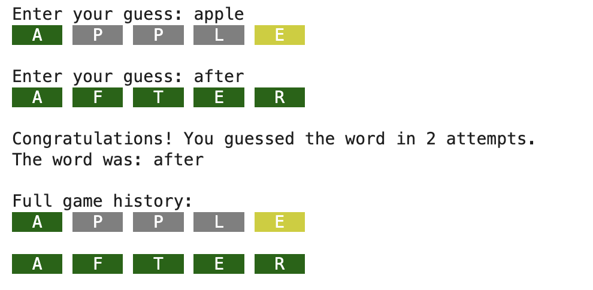
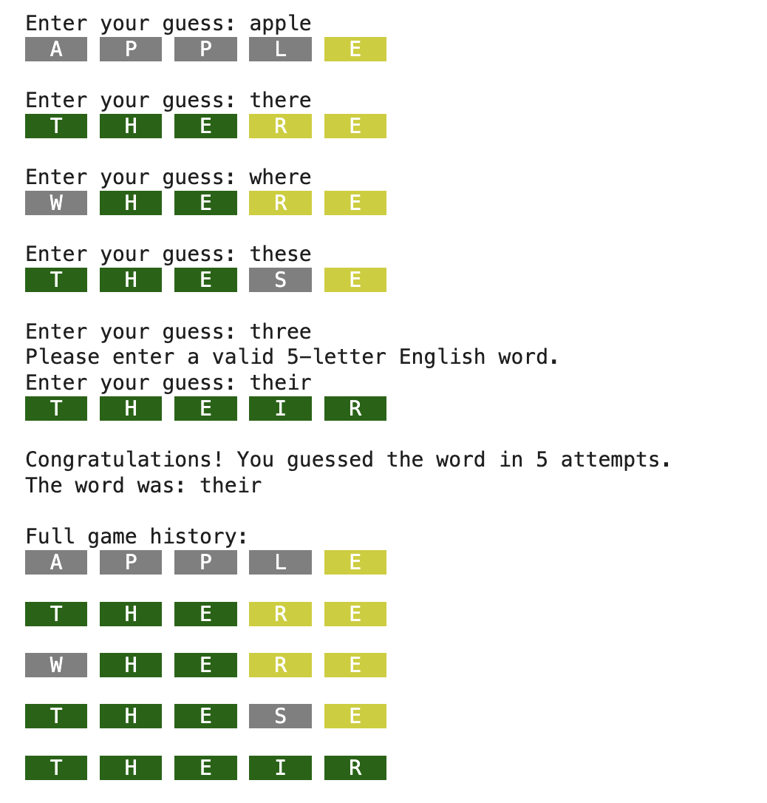

# 🎮 Wordle (Python)

A command-line implementation of the popular **Wordle** game built in Python using **file handling, string processing, randomization, input validation, and 2D arrays**. The game follows the core mechanics of Wordle and validates guesses using a custom dictionary of five-letter words.

---

## 📌 Project Overview

This project recreates the classic Wordle game in the terminal. The player must guess a randomly selected **5-letter word** within **6 attempts**. After every guess, the game provides color-coded feedback indicating which letters are correct and whether they are in the correct position.

The project demonstrates:

- File handling
- Random word selection
- Input validation
- String manipulation
- 2D arrays (fixed-size game board)
- Terminal-based game development

---

## 🎯 Game Rules

- The secret word always contains **5 letters**.
- The player has **6 attempts**.
- Every guess must:
  - contain exactly 5 alphabetic characters
  - exist in the provided dictionary file
- Invalid guesses do **not** consume an attempt.

---

## 🟩 Feedback System

| Color | Meaning |
|-------|---------|
| 🟩 Green | Correct letter in the correct position |
| 🟨 Yellow | Correct letter but in the wrong position |
| ⬛ Gray | Letter is not present in the word |

The game ends when the player either:

- guesses the word correctly, or
- uses all six attempts.

---

## ⚙️ How It Works

### 1. Random Word Selection

The secret word is selected randomly from a text file named:

`five_letter_words_no_repeats.txt`

The program generates a random line number and reads that word from the file.

---

### 2. Guess Validation

Each guess is checked to ensure that it:

- contains exactly five letters
- contains only alphabetic characters
- exists in the dictionary file

Invalid guesses are rejected without reducing the number of remaining attempts.

---

### 3. Guess Evaluation

Each guess is compared with the secret word in multiple passes:

1. Correct letters in the correct position → **Green**
2. Correct letters in the wrong position → **Yellow**
3. Letters not found in the word → **Gray**

---

### 4. Game Board

The game stores guesses using two fixed-size **6 × 5** grids:

- Guess Grid
- Color Feedback Grid

This simulates the layout of the original Wordle board.

---

## 📂 Project Files

```
Wordle/
│── lab10_wordle.py
│── five_letter_words_no_repeats.txt
│── output_case_1.png
│── output_case_2.png
└── README.md
```

---

## 🛠 Technologies Used

- Python 3
- File Handling
- Random Module
- String Processing
- 2D Arrays
- Terminal Output

---

## ▶️ How to Run

```bash
python3 lab10_wordle.py
```

Ensure that `five_letter_words_no_repeats.txt` is located in the same directory as the Python file.

---

# 📸 Example Output

## ✅ Output Case 1



---

## ✅ Output Case 2



---

## 💡 Learning Outcomes

This project demonstrates:

- Reading data from text files
- Random word selection
- Input validation
- Nested loops
- String comparison algorithms
- Fixed-size 2D arrays
- Terminal-based game development
- Python programming fundamentals

---

## 👩‍💻 Author

**Fatima Sharafat**

